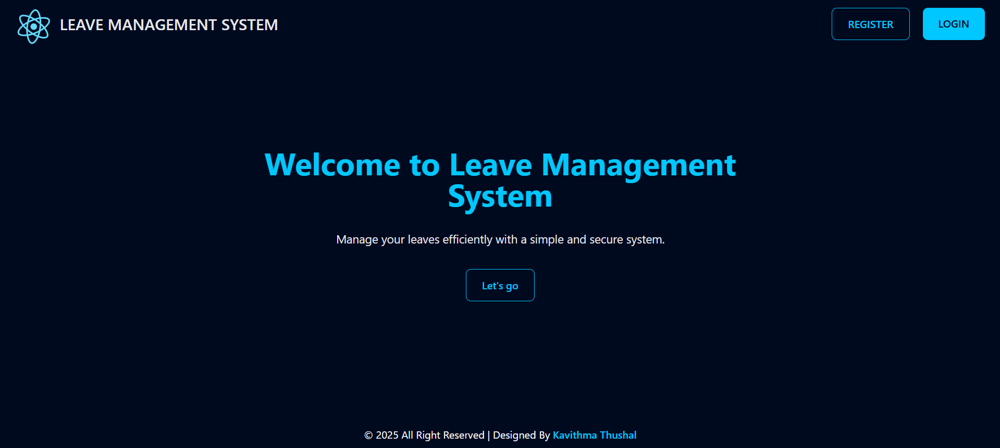
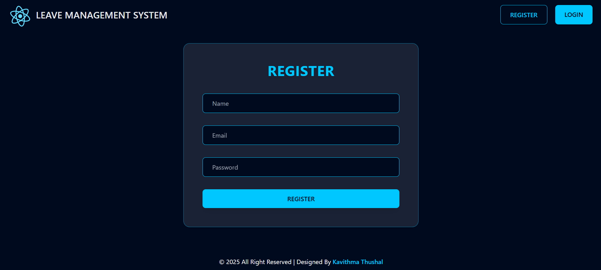
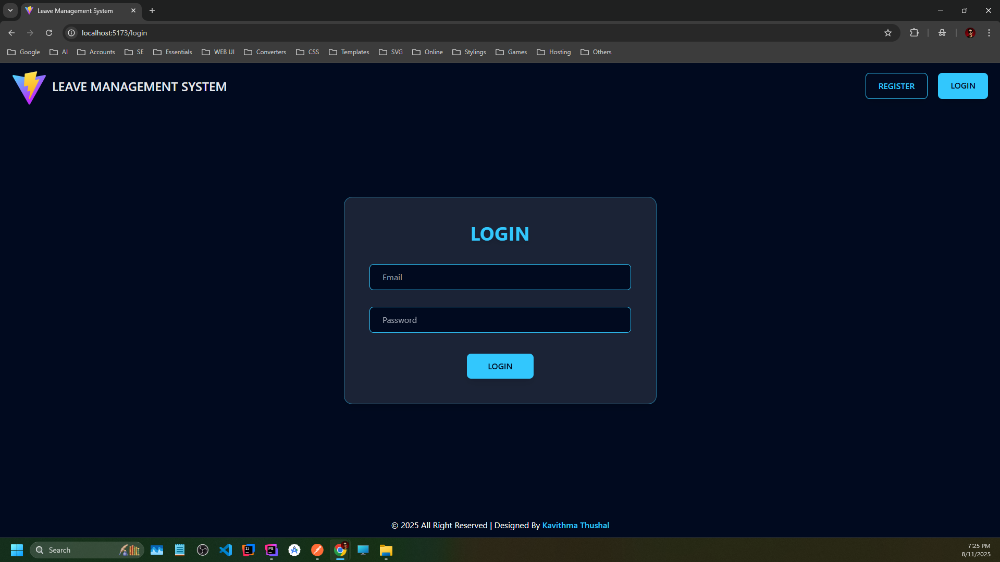
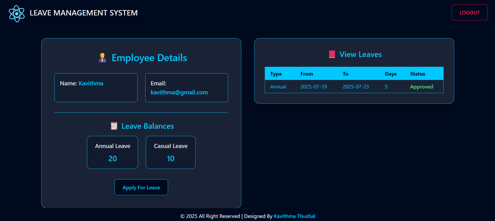
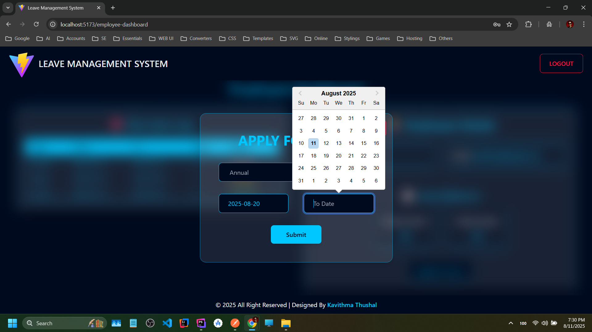
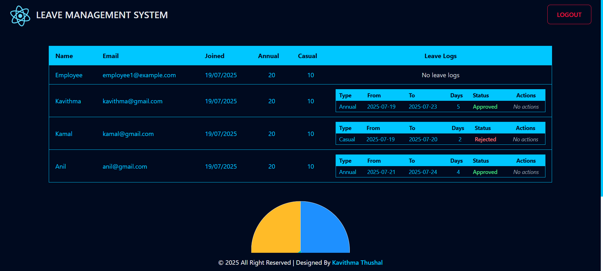
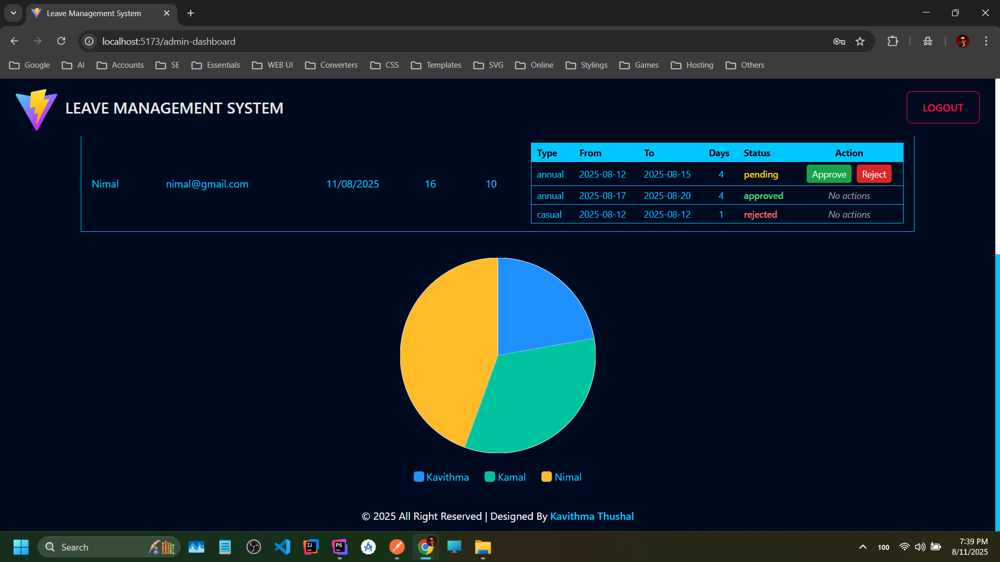
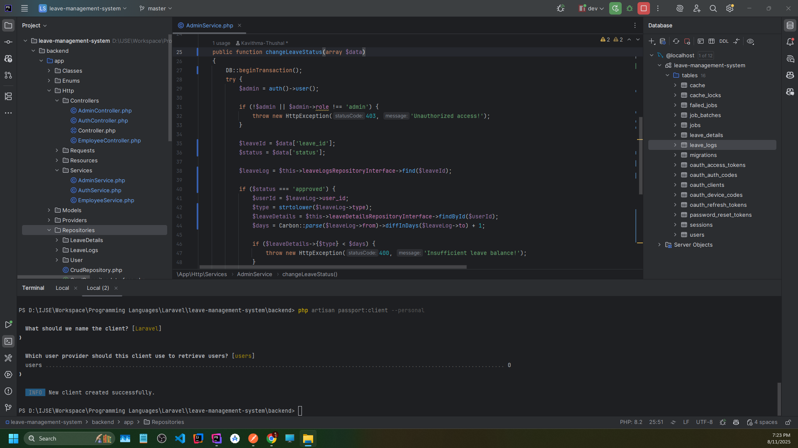
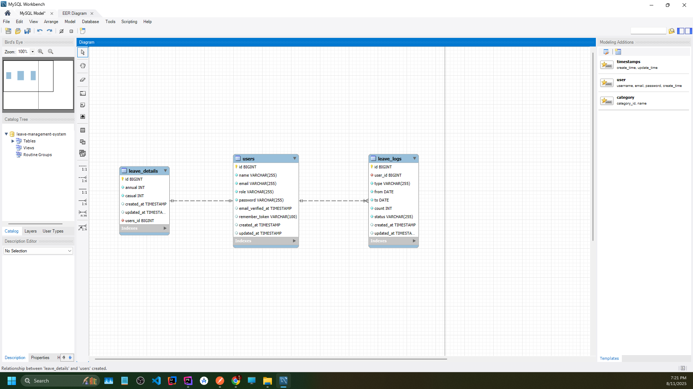

# ⭐ Leave Management System ⭐

Welcome to the **Leave Management System** — a sleek and modern web application designed to streamline leave management
processes. Powered by **Laravel** (backend), **React** (frontend), and **MySQL** (database), it offers a seamless
experience for both **Employees** and **Admins** through intuitive web interfaces and robust API access.

## 🛠️ Tech Stack

### 🔥 Frontend

✅ React 
✅ Axios 
✅ React Router 
✅ Tailwind CSS 

### 🔥 Backend

✅ Laravel 
✅ Laravel Passport 
✅ MySQL 

## 🚀 Features

### 👷 Employee

✅ Register/Login 
✅ Apply for leave 
✅ View leave status 

### 👨‍💼 Admin

✅ Login 
✅ View all leave requests 
✅ Approve/Reject leave 
✅ View users & leave statistics 

## 🔗 API Endpoints (Laravel)

✅ POST /api/login 
✅ POST /api/register 
✅ GET /api/leaves 
✅ POST /api/leaves 
✅ PUT /api/leaves/{id} 
✅ GET /api/user 

## 🌐 Web Views (React)

✅ Login/Register Page 
✅ Employee Dashboard: Leave application form, Leave status list 
✅ Admin Dashboard: Leave approval list, Approve/Reject buttons, Users overview 

## 🔄 Seeding Information

### 👨‍💼 Admin

✅ Email: `admin@example.com` 
✅ Password: `password` 

### 👷 Employee

✅ Email: `employee1@example.com` 
✅ Password: `password` 

## ▶️ How to Run the Project

### ⚛️ Frontend (React)

1. Install dependencies - `npm install`
2. Start the development server - `npm run dev`

### 📦 Backend (Laravel)

1. Install dependencies - `composer install`
2. Prepare the database - `php artisan migrate`
3. Seed the database - `php artisan db:seed`
4. Create Passport personal access client - `php artisan passport:client --personal`
5. Start the Laravel server - `php artisan serve`

## 📸 Screenshots

### Home

### Register

### Login

### Employee Dashboard

### Apply For Leave

### Admin Dashboard

### Leave-Analysis

### Codes

### Schema

## 📬 Get in Touch

For any queries, issues, or support, feel free to reach out!

📧 [kavithmathushal9007@gmail.com](mailto:kavithmathushal9007@gmail.com)

#### © 2025 All Rights Reserved | Designed by [Kavithma Thushal](https://github.com/Kavithma-Thushal)

